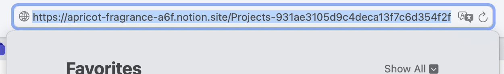
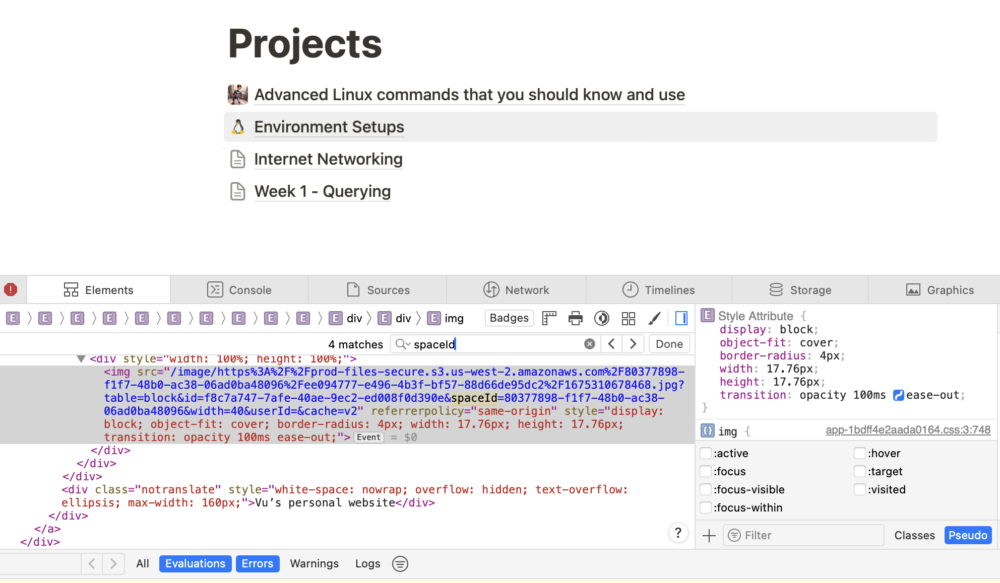

This is my personal website bootstrapped with [`create-next-app`](https://github.com/vercel/next.js/tree/canary/packages/create-next-app). If you wanna use my template, just feel free to do so and give me a star!

## Features

This website is built with react, nextjs and react-notion-x. For the projects and blogs, I find it much easier to write in notion. In my opinion, Notion is the best note-taking app out there, so why not taking note in Notion and use some third-party library to generate such the page inside my own react website?. I use [`react-notion-x`](https://github.com/NotionX/react-notion-x) to achieve this, you can take a closer look at my source code in [`blogs`](./app/blogs) to see how I achieve it.

To generate contents from your notion page, you need to get the `BLOG_ROOT_PAGE_ID` and `BLOG_ROOT_SPACE_ID` from your own website. `ROOT_PAGE_ID` is the id at the root page as shown here


To find the `ROOT_SPACE_ID` in your notion page, right click and click on `Inspect Element`, then `Ctrl-F`, type `spaceId` and copy the ID after the `spaceId=` in your browser as shown here.


I have an example environment file named `.env.example` for you to begin with. To use it in your project, run `mv .env.example .env` to change it to `.env` and modify these values accordingly.

## Getting Started

First, run the development server:

```bash
npm run dev
# or
yarn dev
# or
pnpm dev
# or
bun dev
```

Open [http://localhost:3000](http://localhost:3000) with your browser to see the result.

You can start editing the page by modifying `app/page.tsx`. The page auto-updates as you edit the file.

This project uses [`next/font`](https://nextjs.org/docs/basic-features/font-optimization) to automatically optimize and load Inter, a custom Google Font.

## Deploy on Vercel

The easiest way to deploy your Next.js app is to use the [Vercel Platform](https://vercel.com/new?utm_medium=default-template&filter=next.js&utm_source=create-next-app&utm_campaign=create-next-app-readme) from the creators of Next.js.

Check out our [Next.js deployment documentation](https://nextjs.org/docs/deployment) for more details.

## Contact
If you have any issues or questions, feel free to ask me!